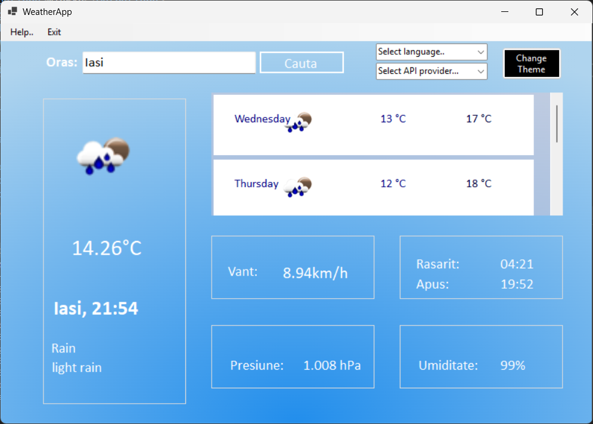
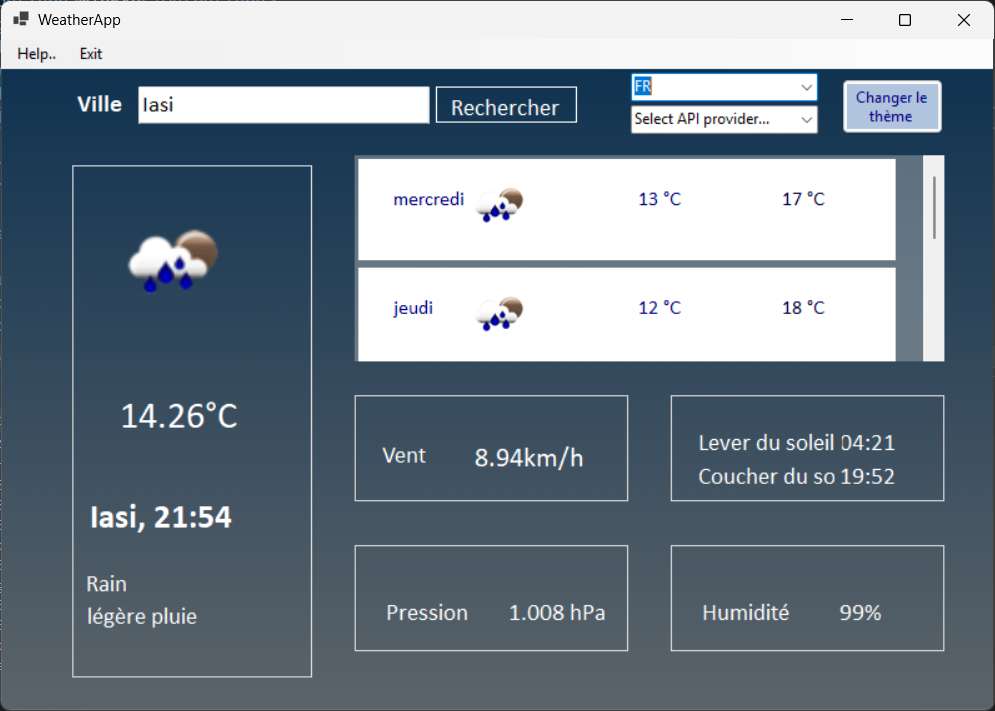

# 🌦️ Weather App

Aplicație meteo desktop dezvoltată în C# (.NET + WinForms), care oferă prognoza pe termen scurt și mediu (5 zile), folosind servicii externe precum OpenWeatherMap și IP-API pentru geolocalizare.

## 🧑‍💻 Echipa

- Bărîlă Matei
- Iva Antonin
- Mantea Elena-Izabela
- Stati Andreea

Universitatea Tehnică “Gheorghe Asachi” Iași  
Facultatea Automatică și Calculatoare  
Specializarea Calculatoare și Tehnologia Informației

---

## 📷 Capturi de ecran

### 🌤️ Interfața principală - Temă luminoasa



### 🌓 Tema întunecată


### 🌐 Selectare limbă



### Selectare Weather Provider


---

## 🚀 Funcționalități principale

- Detectarea automată a locației utilizatorului (prin IP)
- Introducerea manuală a orașului
- Afișare:
  - temperaturi maxime/minime
  - condiții meteo (pictograme)
  - vânt, presiune, răsărit/apus
- Schimbarea limbii interfeței
- Alegerea furnizorului de prognoză meteo
- Teme (Light/Dark)

---

## 🧱 Tehnologii folosite

- C#
- .NET Framework
- Windows Forms (WinForms)
- API-uri externe:
  - [OpenWeatherMap](https://openweathermap.org/api)
  - [IP Geolocation API](http://ip-api.com/docs)
  - (opțional) [WeatherBit](https://www.weatherbit.io/)
  - [Wttr.in](https://github.com/chubin/wttr.in)

---

## 🏗️ Arhitectură

Aplicația este modulară, cu servicii pentru localizare, traducere, temă, și obținerea datelor meteo. Suportă extensibilitate și decoratori (ex: retry, logging).

### 🔧 Componente cheie

- `LocationService`, `RetryLocationService`, `LoggingLocationService`
- `WeatherProviderFactory`, `WeatherForecast`
- `ThemeManagerService`
- `LanguageManagerService`

---

## 🧪 Testare

Aplicația are acoperire extinsă prin teste unitare:

- ✅ Testare JSON și deserializare prognoză
- ✅ Testare serviciu locație și logging
- ✅ Testare provider API (valid/invalid key, locații)
- ✅ Testare management temă și limbă

---

## ⚙️ Cerințe de rulare

- Windows OS
- .NET Framework instalat
- Conexiune la internet

---

## 🔒 Securitate & Confidențialitate

Aplicația accesează doar adresa IP a utilizatorului pentru a determina locația. Nu sunt colectate sau salvate alte date personale.

---

## 📥 Instalare și utilizare

1. Clonează acest repo:
```bash
git clone https://github.com/MateiB20/Proiect-n-echip-ingineria-program-rii
```
2. Din structura proiectului, navighează în directorul aplicației: WeatherApp/

3. Deschide fișierul soluție: WeatherApp.sln cu Visual Studio

4. Rulează aplicația: În Visual Studio, apasă Ctrl + F5 pentru a rula fără debugging.


